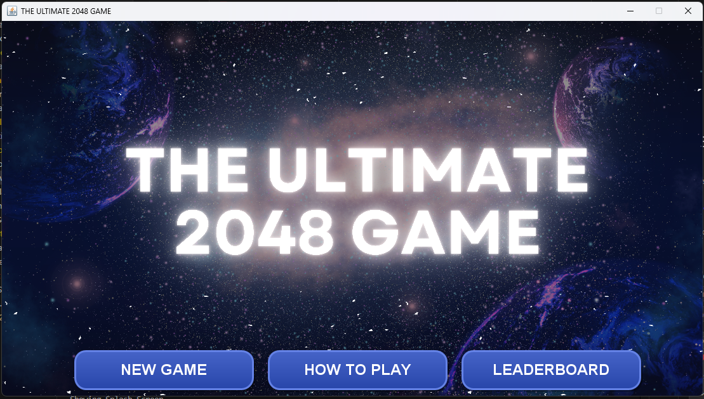
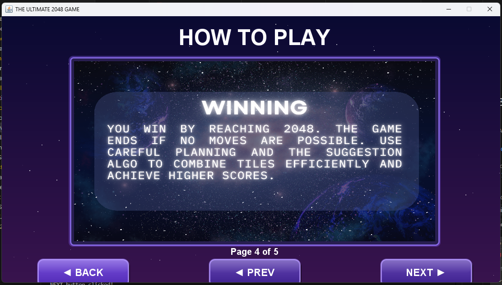
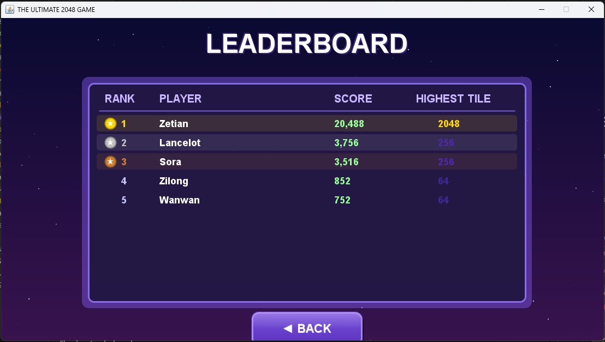
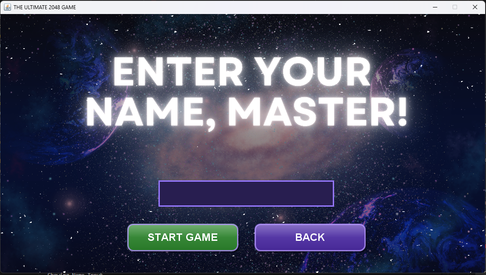
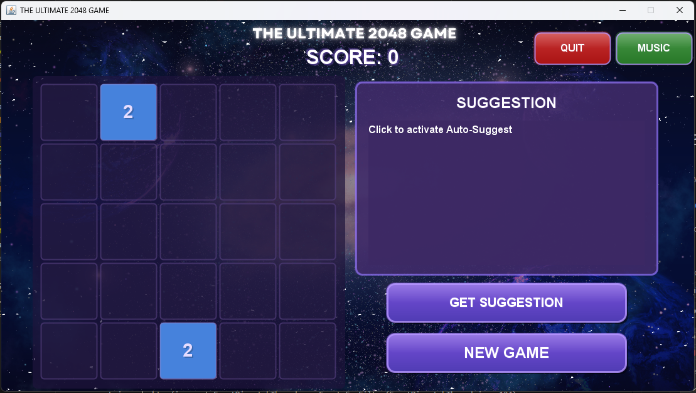
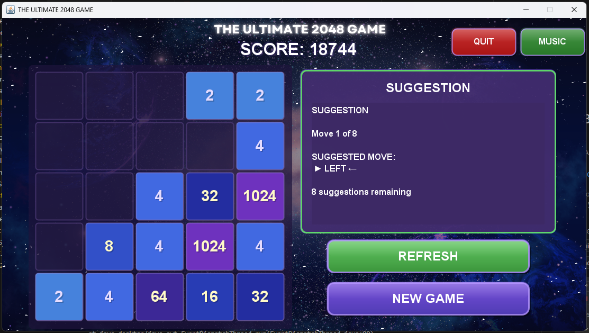

# 🎮 THE ULTIMATE 2048 GAME 🎮

—9§———— *.* 🎮 *.* ————9§———— *.* 🎮 *.* ————9§———— *.* 🎮 *.* ————9§———— *.* 🎮 *.* ————9§—

**A final project for CMSC 122: Data Structure and Algorithm**  
BS in Computer Science Program  
University of the Philippines Tacloban College

—9§———— *.* 🎮 *.* ————9§———— *.* 🎮 *.* ————9§———— *.* 🎮 *.* ————9§———— *.* 🎮 *.* ————9§—

## 📖 Overview

**The Ultimate 2048 Game** is an enhanced version of the classic 2048 puzzle game that takes your gaming experience to the next level. Built with advanced algorithms and an intuitive interface, this game offers both challenge and strategic assistance for players of all skill levels.

The game features an **expanded 5×5 board** for more complex gameplay and introduces a **Suggest Button** - a move recommendation system that analyzes your board state and provides optimal move suggestions.

### ✨ Key Highlights

- 🎯 **Expanded 5×5 Board** - More space for strategic gameplay
- 🤖 **AI-Powered Suggestions** - Smart move recommendations using expectimax algorithm
- 🎵 **Immersive Audio** - Background music and sound effects
- 🏆 **Leaderboard System** - Track your high scores and compete
- 💾 **Persistent Data** - Save and load game progress
- 🎨 **Polished UI** - Custom graphics and smooth animations

---

## 🎯 Game Features

### 🎲 Enhanced Gameplay

- **5×5 Grid System**: Larger playing field compared to the classic 4×4 board
- **Extended Score Potential**: Achieve higher tile values and scores
- **Smooth Animations**: Fluid tile movements and merge effects
- **Intuitive Controls**: Arrow keys for seamless gameplay

### 🧠 Intelligent Assist System

The game features a sophisticated **Suggest Button** that analyzes the current board state and recommends optimal moves:

- **Real-time Analysis**: Evaluates all possible moves and their outcomes
- **Strategic Guidance**: Helps players learn advanced strategies
- **Expectimax Algorithm**: Uses game theory principles to calculate best moves
- **Visual Feedback**: Clear indication of suggested directions

### 🎵 Audio Experience

- **Background Music**: Two ambient tracks (Space Song by Beach House & Satellite by Harry Styles)
- **Persistent Playback**: Music continues across game screens
- **Sound Effects**: Responsive audio feedback for game actions

### 📊 Progress Tracking

- **Local Leaderboard**: Top scores saved automatically
- **Player Profiles**: Enter your name to track personal records
- **Score History**: Review past performances

### 🎨 Visual Design

- **Custom Graphics**: Hand-crafted UI elements and tile designs
- **Color-Coded Tiles**: Easy identification of tile values
- **Splash Screen**: Professional game introduction
- **Responsive Layout**: Clean and organized interface

---

## 🖼️ Screenshots

### Splash Screen

*Welcome screen with game title and animated introduction*

### Instructions

*Helpful guide on how to play the game*

### Leaderboard

*Track your high scores and compete with other players*

### Name Input

*Enter your name to save your scores*

### Main Panel

*5×5 game board with smooth tile animations and score tracking*

### Suggestion Feature

*AI-powered move recommendations to help you strategize*

---

## 🚀 Installation & Download

### Prerequisites

- **Java Runtime Environment (JRE) 8 or higher**
  - Check if Java is installed: `java -version`
  - Download from [Oracle](https://www.oracle.com/java/technologies/downloads/) or [OpenJDK](https://openjdk.org/)

### Download the Game

**📥 [DOWNLOAD Ultimate2048Game.jar from Google Drive](https://drive.google.com/drive/folders/19AgLys3qBnBaZkXAzlq5pliS0qbhzjaU?usp=sharing)**

### How to Run

Once you've downloaded the JAR file:

**Windows:**
- Simply double-click `Ultimate2048Game.jar`, or
- Open Command Prompt in the folder where you saved it and run:
  ```cmd
  java -jar Ultimate2048Game.jar
  ```

**Mac/Linux:**
- Double-click `Ultimate2048Game.jar`, or
- Open Terminal in the folder where you saved it and run:
  ```bash
  java -jar Ultimate2048Game.jar
  ```

---

## 🎮 How to Play

### Game Objective

Combine numbered tiles to create a tile with the value **2048**. Keep playing after reaching 2048 to achieve even higher scores!

### Controls

| Key | Action |
|-----|--------|
| `↑` | Move tiles up |
| `↓` | Move tiles down |
| `←` | Move tiles left |
| `→` | Move tiles right |

### Gameplay Rules

1. **Tile Movement**: Press arrow keys to slide all tiles in that direction
2. **Merging**: When two tiles with the same number collide, they merge into one tile with double the value
3. **New Tiles**: After each move, a new tile (2 or 4) appears in a random empty spot
4. **Winning**: Reach the 2048 tile to win
5. **Game Over**: The game ends when no more moves are possible

### Special Features

- **Suggest Button** (💡): Click to receive AI-powered move recommendations
- **Leaderboard** (🏆): View top scores and player rankings
- **Music Toggle** (🎵): Control background music playback
- **New Game**: Start fresh at any time

---

## 🧠 The Suggest Algorithm

The game implements an advanced **Expectimax Algorithm** for move suggestions:

### Algorithm Overview

```
1. Board State Analysis
   └─ Scan all 25 tiles and their positions
   └─ Identify empty cells and merge opportunities

2. Move Evaluation
   └─ Simulate all four possible moves (Up, Down, Left, Right)
   └─ Calculate expected value for each move
   └─ Consider tile spawning probabilities (90% for 2, 10% for 4)

3. Scoring Heuristics
   └─ Empty cell count (more empty = higher score)
   └─ Tile ordering (highest tiles in corners/edges)
   └─ Merge potential (adjacent same-valued tiles)
   └─ Monotonicity (increasing/decreasing sequences)

4. Optimal Move Selection
   └─ Choose move with highest expected utility
   └─ Display suggestion to player
```

### Key Components

- **Expectimax Tree Search**: Explores game tree with probabilistic tile spawns
- **Heuristic Evaluation**: Multi-factor board state assessment
- **Depth-Limited Search**: Balances accuracy with performance
- **Corner Strategy**: Prioritizes keeping high-value tiles in corners

---

## 🔧 Tech Stack

### Technology Stack

| Component | Technology |
|-----------|-----------|
| **Language** | Java 17+ |
| **GUI Framework** | Java Swing |
| **Audio** | Java Sound API |
| **Build System** | JAR packaging with Manifest |
| **Data Persistence** | Java File I/O |
| **Version Control** | Git/GitHub |

### Core Components

```
game2048/
├── Main.java              # Application entry point
├── Game.java              # Core game logic and board management
├── Board.java             # Board state and tile operations
├── Tile.java              # Individual tile representation
├── Expectimax.java        # AI suggestion algorithm
├── GameplayScreen.java    # Main game UI
├── SplashScreen.java      # Introduction screen
├── Leaderboard.java       # Score tracking and display
├── LeaderboardManager.java # Persistent score storage
├── MusicPlayer.java       # Audio playback management
├── NameInputPanel.java    # Player name entry
├── Instructions.java      # Help and tutorial screen
├── CustomDialog.java      # Custom dialog components
└── Suggestion.java        # Move suggestion display
```

---

## 📁 Project Structure

```
The-Ultimate-2048-Game/
├── src/
│   └── game2048/          # Source code files
│       ├── Main.java
│       ├── Game.java
│       ├── Board.java
│       └── ... (other .java files)
├── components/
│   ├── images/            # Game graphics
│   │   ├── background.png
│   │   ├── splashscreen.png
│   │   └── ... (other .png files)
│   └── music/             # Audio files
│       ├── Beachhouse.wav
│       └── Satellite.wav
├── screenshots/           # Game screenshots for README
│   ├── splash-screen.png
│   ├── gameplay.png
│   ├── leaderboard.png
│   └── suggest-feature.png
├── build/                 # Compiled class files (generated)
├── MANIFEST.MF           # JAR manifest file
├── build.bat             # Windows build script
├── build.sh              # Mac/Linux build script
├── Ultimate2048Game.jar  # Executable JAR file (generated)
└── README.md             # This file
```


## 👥 Contributors

**🎓 Mark Asher G. Abesia** - BSCS 2  
*Lead Developer & Project Designer*  
University of the Philippines Tacloban College

—9§———— *.* 🎮 *.* ————9§———— *.* 🎮 *.* ————9§———— *.* 🎮 *.* ————9§———— *.* 🎮 *.* ————9§—
